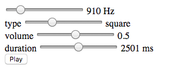

# oscillator

I just wanted to be able to create a beep using webtechnologies: **AudioContext**.



## Try it

[Try it](https://pearpages.com/oscillator)

## Code

```html
<input type="range" id="fIn" min="40" max="6000" oninput="show()" />
<span id="fOut"></span><br>
type
<input type="range" id="tIn" min="0" max="3" oninput="show()" />
<span id="tOut"></span><br>
volume
<input type="range" id="vIn" min="0" max="100" oninput="show()" />
<span id="vOut"></span><br>
duration
<input type="range" id="dIn" min="1" max="5000" oninput="show()" />
<span id="dOut"></span>
<br>
<button onclick='beep();'>Play</button>
```

```js
audioCtx = new(window.AudioContext || window.webkitAudioContext)();

show();

function show() {
  frequency = document.getElementById("fIn").value;
  document.getElementById("fOut").innerHTML = frequency + ' Hz';

  switch (document.getElementById("tIn").value * 1) {
    case 0: type = 'sine'; break;
    case 1: type = 'square'; break;
    case 2: type = 'sawtooth'; break;
    case 3: type = 'triangle'; break;
  }
  document.getElementById("tOut").innerHTML = type;

  volume = document.getElementById("vIn").value / 100;
  document.getElementById("vOut").innerHTML = volume;

  duration = document.getElementById("dIn").value;
  document.getElementById("dOut").innerHTML = duration + ' ms';
}

function beep() {
  var oscillator = audioCtx.createOscillator();
  var gainNode = audioCtx.createGain();

  oscillator.connect(gainNode);
  gainNode.connect(audioCtx.destination);

  gainNode.gain.value = volume;
  oscillator.frequency.value = frequency;
  oscillator.type = type;

  oscillator.start();

  setTimeout(
    function() {
      oscillator.stop();
    },
    duration
  );
};
```